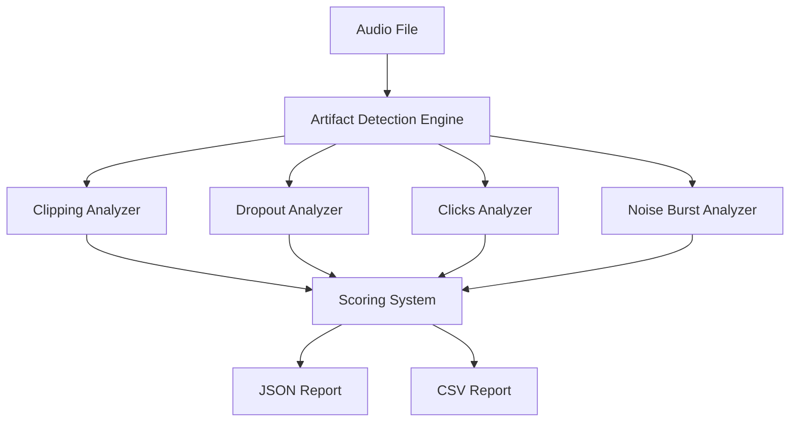

# Audio Artifact Detection Engine

A modular audio quality analysis system for detecting major audio artifacts in audio datasets.

## What it detects

- Clipping
- Dropouts / silence gaps
- Click / pop burst regions
- Noise bursts
  
## Features

- Per-file artifact analysis
- Timestamped severity flags
- Overall quality scoring
- Batch folder scanning
- JSON and CSV report export

## Architecture



## Design Philosophy

The system is designed as a modular analysis pipeline:

audio → analyzers → scoring → reporting

Each artifact detector is implemented as an independent analyzer, allowing new detectors to be added without modifying the core engine.

## Project Structure
- `artifact_detection_engine/` - core engine, analyzers, scoring, models
- `run_engine.py` - single-file runner
- `run_batch.py` - batch folder runner
- `reports/` - generated batch outputs

## Installation

```bash
pip install -e .
```

Or with development dependencies:

```bash
pip install -e ".[dev]"
```

## Usage

### Command Line

Analyze a single file:

```bash
PYTHONPATH=. python3 run_engine.py
```

Analyze multiple files:

```bash
PYTHONPATH=. python3 run_batch.py
```


## Output Format

Analyzer: clipping
Flags: 0

Analyzer: dropouts
Flags: 2

Analyzer: clicks
Flags: 3

Analyzer: noise_bursts
Flags: 0

Final Score: 0.0

## Configuration

See `config.example.yaml` for all available options.

## License

TNT BABY PRODUCTIONS LTD

